# Contract Analysis System - Frontend Migration Architecture Overview

This document provides a comprehensive architectural overview of the Contract Analysis System's frontend after its migration to a React-based application. It highlights the mapping from the legacy Flask/Jinja templates to their corresponding React components and illustrates the overall structure, data flow, and interactions between frontend and backend services.

The diagram uses a top-down flowchart layout with distinct subgraphs and color-coded nodes to represent different parts of the system and their roles.

## Architecture Diagram

```mermaid
graph TD
    subgraph "Legacy Flask/Jinja Templates (Before Migration)"
        L_INDEX["public/index.html<br><i>(React App Mount Point)</i>"]:::legacyHtml
        L_RESULTS["templates/results.html<br><i>(Historical Results List)</i>"]:::legacyHtml
        L_DETAIL["templates/result-detail.html<br><i>(Single Result Details)</i>"]:::legacyHtml
        L_ADMIN["templates/admin_cache.html<br><i>(Cache Management)</i>"]:::legacyHtml
    end

    subgraph "React Frontend Application (After Migration)"
        direction LR
        R_APP["src/App.tsx<br><i>(Main Router & Layout)</i>"]:::reactComponent
        R_UPLOAD["src/components/DocumentUpload.tsx<br><i>(File Upload UI)</i>"]:::reactComponent
        R_ANALYSIS_RESULTS["src/components/AnalysisResults.tsx<br><i>(Current Analysis Display)</i>"]:::reactComponent
        R_HISTORICAL_RESULTS["src/components/HistoricalResults.tsx<br><i>(Historical Results List UI)</i>"]:::reactComponent
        R_RESULT_DETAIL["src/components/ResultDetail.tsx<br><i>(Single Result Detail UI)</i>"]:::reactComponent
        R_ADMIN_CACHE["src/components/AdminCache.tsx<br><i>(Cache Management UI)</i>"]:::reactComponent
        R_DISPLAY["src/components/AnalysisResultDisplay.tsx<br><i>(Reusable Result Display)</i>"]:::reactComponent
        R_VIEWER["src/components/DocumentViewer.tsx<br><i>(PDF/HTML Viewer Modal)</i>"]:::reactComponent
        R_API_SERVICE["src/services/api.ts<br><i>(Frontend API Service Layer)</i>"]:::service
        R_TYPES["src/services/types.ts<br><i>(Data Models)</i>"]:::dataModel

        R_APP -- "Routes to" --> R_UPLOAD
        R_APP -- "Routes to" --> R_ANALYSIS_RESULTS
        R_APP -- "Routes to" --> R_HISTORICAL_RESULTS
        R_APP -- "Routes to" --> R_RESULT_DETAIL
        R_APP -- "Routes to" --> R_ADMIN_CACHE

        R_UPLOAD -- "Calls apiService.uploadDocument" --> R_API_SERVICE
        R_ANALYSIS_RESULTS -- "Uses" --> R_DISPLAY
        R_ANALYSIS_RESULTS -- "Requests Document View" --> R_VIEWER
        R_HISTORICAL_RESULTS -- "Calls apiService.getHistoricalResults" --> R_API_SERVICE
        R_HISTORICAL_RESULTS -- "Navigates to" --> R_RESULT_DETAIL
        R_RESULT_DETAIL -- "Calls apiService.getResultDetail" --> R_API_SERVICE
        R_RESULT_DETAIL -- "Uses" --> R_DISPLAY
        R_RESULT_DETAIL -- "Requests Document View" --> R_VIEWER
        R_ADMIN_CACHE -- "Calls apiService.getCacheAndPgVectorStats,<br>listPgVectorCollections, deletePgVectorCollection,<br>cleanOldCacheEntries, purgeAllCache" --> R_API_SERVICE

        R_DISPLAY -- "Uses" --> R_VIEWER
        R_API_SERVICE -- "Defines" --> R_TYPES
    end

    subgraph "Backend API & Services"
        B_API["FastAPI/Flask Backend API<br><i>(Central Gateway)</i>"]:::backendApi
        B_DB["Database / PGVector Store<br><i>(Data Persistence & Embeddings)</i>"]:::backendService
        B_DOC_PROCESSOR["Document Processor<br><i>(Conversion, Highlighting)</i>"]:::backendService
        B_CLASSIFIERS["Analysis Classifiers<br><i>(Lease, Dealer, Buyback Logic)</i>"]:::backendService

        R_API_SERVICE -- "HTTP Requests" --> B_API

        B_API -- "Stores/Retrieves Data" --> B_DB
        B_API -- "Processes Documents" --> B_DOC_PROCESSOR
        B_API -- "Executes Analysis" --> B_CLASSIFIERS

        B_DOC_PROCESSOR -- "Stores Processed Docs" --> B_DB
        B_CLASSIFIERS -- "Interacts with" --> B_DB
    end

    subgraph "Migration Mapping"
        L_RESULTS -- "Migrated to" --> R_HISTORICAL_RESULTS:::migration
        L_DETAIL -- "Migrated to" --> R_RESULT_DETAIL:::migration
        L_ADMIN -- "Migrated to" --> R_ADMIN_CACHE:::migration
    end

    classDef legacyHtml fill:#FFDDC1,stroke:#E67E22,stroke-width:2px;
    classDef reactComponent fill:#D4EDDA,stroke:#28A745,stroke-width:2px;
    classDef service fill:#ADD8E6,stroke:#007BFF,stroke-width:1px;
    classDef dataModel fill:#F0F8FF,stroke:#6C757D,stroke-width:1px;
    classDef backendApi fill:#FFCCCC,stroke:#DC3545,stroke-width:2px;
    classDef backendService fill:#E0FFFF,stroke:#17A2B8,stroke-width:1px;
    classDef migration stroke:#FFC107,stroke-width:3px,color:#000;
```

## Explanation of Components and Data Flow

### Legacy Flask/Jinja Templates
These are the original HTML templates rendered by the Flask/FastAPI backend. They contain embedded JavaScript that directly interacts with the backend API.
*   `public/index.html`: The entry point for the React application. It's a minimal HTML file that serves as the root for the React app to be mounted.
*   `templates/results.html`: Displays a paginated list of historical analysis results. It includes search filters and links to view detailed results.
*   `templates/result-detail.html`: Shows the detailed view of a single analysis result, including file information, analysis classification, confidence, and an embedded document viewer.
*   `templates/admin_cache.html`: Provides an interface for managing backend cache, including viewing statistics, listing PGVector collections, and performing maintenance actions like cleaning or purging cache entries.

### React Frontend Application
This is the new React-based frontend, built using Create React App, TypeScript, and Bootstrap. It consumes data from the backend API via a dedicated service layer.
*   `src/App.tsx`: The main application component. It sets up the React Router to handle navigation between different views (upload, results, detail, admin).
*   `src/components/DocumentUpload.tsx`: Handles the user interface for uploading documents for analysis. It interacts with `apiService` to send files to the backend.
*   `src/components/AnalysisResults.tsx`: Displays the immediate results after a document analysis. It uses `AnalysisResultDisplay` for rendering the core analysis data and can trigger `DocumentViewer`.
*   `src/components/HistoricalResults.tsx`: Replaces `templates/results.html`. It fetches and displays a paginated list of past analysis results, including search and filtering capabilities. It navigates to `ResultDetail.tsx` for individual result views.
*   `src/components/ResultDetail.tsx`: Replaces `templates/result-detail.html`. It fetches and displays the detailed information for a specific analysis result, leveraging `AnalysisResultDisplay` and `DocumentViewer`.
*   `src/components/AdminCache.tsx`: Replaces `templates/admin_cache.html`. It provides the UI for cache management, interacting with `apiService` to fetch statistics, list collections, and perform cache operations.
*   `src/components/AnalysisResultDisplay.tsx`: A reusable component responsible for rendering the structured analysis data (classification, criteria, evidence, decision trees). It's used by both `AnalysisResults.tsx` and `ResultDetail.tsx`.
*   `src/components/DocumentViewer.tsx`: A modal component that displays PDF or HTML documents, often with highlighted evidence. It receives a document hash and optional evidence to highlight.
*   `src/services/api.ts`: The central service layer for all frontend-to-backend API communication. It encapsulates `fetch` or `axios` calls and handles request/response parsing.
*   `src/services/types.ts`: Defines TypeScript interfaces and types for data structures used throughout the frontend, ensuring type safety for API responses and component props.

### Backend API & Services
This represents the Flask/FastAPI backend, which provides RESTful APIs for the frontend and interacts with various internal services.
*   `FastAPI/Flask Backend API`: The main entry point for all frontend requests. It handles routing, request validation, and orchestrates calls to internal services.
*   `Database / PGVector Store`: Stores analysis results, document metadata, and vector embeddings for efficient retrieval and similarity search (used by RAG).
*   `Document Processor`: Responsible for tasks like converting documents (PDF to HTML, Excel to HTML), extracting text, and highlighting evidence within documents.
*   `Analysis Classifiers`: Contains the business logic for different types of contract analysis (e.g., lease, dealer, buyback), often leveraging RAG (Retrieval Augmented Generation) with the PGVector store.

### Migration Mapping
This section explicitly shows which legacy HTML templates have been replaced by their corresponding React components, signifying the successful migration of those functionalities to the new frontend architecture.
